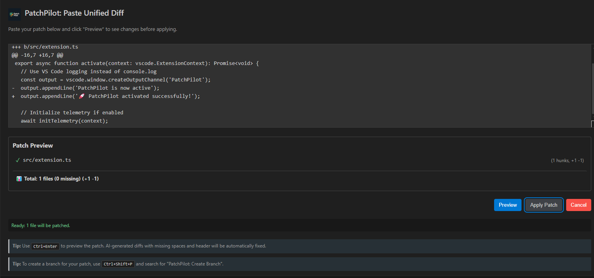

# PatchPilot 🚀

## **AI-Smart Diff & Patch Engine for VS Code** ✨

[](https://marketplace.visualstudio.com/items?itemName=patchpilot.patch-pilot)
[](https://marketplace.visualstudio.com/items?itemName=patchpilot.patch-pilot)
[](https://marketplace.visualstudio.com/items?itemName=patchpilot.patch-pilot)
[](LICENSE)

---



---

## 🚀 Why PatchPilot?

*PatchPilot turns raw diffs—whether hand-written, auto-generated by AI, or copied
from code reviews—into perfectly-applied patches inside VS Code, even when line
numbers have drifted or files have shifted. Stop hunting for the right hunk,
start trusting your patches.*

### Key benefits

| | |
|---|---|
| 🧠 **AI-grade fuzzy matching** | Applies unified diffs even when context lines move, whitespace changes, or the file has been refactored. |
| ⬆️ **Saves tokens** | Paste diffs instead of whole files when working with ChatGPT / Copilot—maximises the LLM context window. |
| 🛡️ **Preview & confirm** | Side-by-side diff preview before anything touches your working tree. |
| 🔀 **Seamless Git flow** | Optional auto-stage; honours your branch & commit settings; never clobbers un-committed work. |
| 🔒 **Offline-friendly** | All matching happens locally—no code or diff contents leave your machine. |

---

## 🔧 Installation

```bash
ext install patchpilot.patch-pilot
```

> **VS Code Extension Marketplace**

1. Open **VS Code**.
2. Open **Extensions** (`Ctrl+Shift+X`).
3. Search **PatchPilot**.
4. Click **Install**.

---

## 💡 How to Use PatchPilot

### Via Command Palette

- Copy a unified diff.
- `Ctrl+Shift+P` → **`PatchPilot: Paste Diff`** → Preview → Apply.

- Create a git branch
- `Ctrl+Shift+P` → **`PatchPilot: Create Branch for Patch`** → Preview → Apply.

### Via Context Menu

- Select diff text.
- Right-click → **`PatchPilot: Apply Selected Diff`** → Preview → Apply.

---

## 🧠 Ultimate AI Assistant Prompt for PatchPilot

> To optimize your workflow with AI assistants (like Claude, ChatGPT, Gemini) and PatchPilot, provide the following instructions to your AI at the beginning of your coding session. This ensures the AI focuses on generating efficient diffs that PatchPilot can readily apply, saving context window tokens and streamlining your development process.

```plaintext
      
--- PatchPilot AI Code Generation Instructions ---

**CONTEXT:** I am using a VS Code extension called PatchPilot. Your primary task when I request code changes is to provide ONLY the modifications in the standard **unified diff format**. Do NOT output the complete modified file(s).

**CORE RULES FOR ALL CODE RESPONSES:**

1.  **OUTPUT FORMAT:** MUST be **unified diff**.
    *   Example:
        ```diff
        diff --git a/path/to/file.ext b/path/to/file.ext
        --- a/path/to/file.ext
        +++ b/path/to/file.ext
        @@ -old_start,old_lines +new_start,new_lines @@
         context line (unchanged)
        -line to remove
        +line to add
         another context line
        ```

2.  **FILE PATHS:** MUST use correct **relative paths** from the project root in all header lines (`diff --git`, `---`, `+++`).
    *   Example: `src/components/Button.tsx`, NOT `Button.tsx` or `/abs/path/to/Button.tsx`.

3.  **CONTEXT LINES:** MUST include **at least 3 lines** of unchanged context before and after each changed block within a hunk (`@@ ... @@`). Lines starting with a space are context lines.

4.  **MULTI-FILE CHANGES:** MUST be combined into a **single diff output block**. Each file's changes must be separated by the standard `diff --git ...` header sequence for that file.

5.  **NEW FILES:** MUST use `/dev/null` as the source file in headers.
    *   Example:
        ```diff
        diff --git a/dev/null b/path/to/new_file.ext
        --- /dev/null
        +++ b/path/to/new_file.ext
        @@ -0,0 +1,5 @@
        +new line 1
        +new line 2
        +new line 3
        +new line 4
        +new line 5
        ```

6.  **IGNORE MINOR FORMATTING:** You do **not** need to worry about:
    *   Line Endings: PatchPilot normalizes LF/CRLF automatically.
    *   Leading Spaces: PatchPilot adds missing leading spaces on context lines automatically.
    *   Focus on generating the *correct code change logic* within the diff structure.

**PERSISTENCE:** Please adhere to these rules **consistently** for all subsequent code modification requests in this session without needing further reminders. Respond ONLY with the diff block unless I specifically ask for something else.

    
```

✅ This ensures every AI response seamlessly integrates with PatchPilot.

---

## ✨ Key Features

### ⚙️ Smart Patch Application

- Fixes missing spaces in context.
- Handles CRLF/LF line endings automatically.
- Adds missing diff headers when needed.
- Cleans file paths with hidden characters.

### 🧩 Fuzzy Matching (Three-Tier Strategy)

- **Strict Mode** → Exact match.
- **Shifted Mode** → Finds nearby lines.
- **Greedy Mode** → Match based on added/removed lines.

### 📂 Multi-File Diff Support

### 🔗 Git Integration

- Auto-stage patches.
- Create temporary branches instantly. Can use randomized name or custom one.

---

## ⚙️ Settings Overview

| Setting                             | Type         | Default | Description                                                                                                                   |
|:------------------------------------|:-------------|:--------|:------------------------------------------------------------------------------------------------------------------------------|
| `patchPilot.autoStage`              | boolean      | `false` | Auto-stage patched files                                                                                                      |
| `patchPilot.autoCorrectHunkHeaders` | boolean      | `true`  | Automatically correct inaccurate line counts found in hunk headers (`@@ ... @@`). Disable if this causes issues.             |
| `patchPilot.fuzzFactor`             | enum (0-3)   | `2`     | Controls fuzzy matching aggression                                                                                            |
| `patchPilot.mtimeCheck`             | boolean      | `true`  | Check file modification times                                                                                                 |
| `patchPilot.enableTelemetry`        | boolean      | `false` | Send minimal anonymous telemetry                                                                                              |

### ⌨️ Keyboard Shortcuts

- Launch PatchPilot: `Ctrl+Alt+P` / `Cmd+Alt+P`
- Preview Patch: `Ctrl+Enter` / `Cmd+Enter`

## 🎛 Commands & Keybindings

| Command-palette entry                 | Default key | Description                                                       |
|--------------------------------------|-------------|-------------------------------------------------------------------|
| **PatchPilot : Paste Diff**           | —           | Paste a unified diff and open the preview editor.                 |
| **PatchPilot : Apply Patch**          | —           | Apply the most recently pasted diff without preview.              |
| **PatchPilot : Parse Patch**          | —           | Display a quick summary (files, hunks, add/del stats).            |
| **PatchPilot : Create Branch**        | —           | Create and switch to a `patchpilot/YYYY-MM-DD` branch.            |
| **PatchPilot : Apply Selected Diff**  | —           | Apply only the lines you highlight in the diff editor.            |

*No default keybindings are set—assign your own in **Preferences › Keyboard Shortcuts**.*

---

## 🔌 PatchPilot API for Extensions

```javascript
// Apply a patch (with optional options)
const results = await vscode.commands.executeCommand('patchPilot.applyPatch', patchText, { preview: true });

// Parse a patch without applying
const fileInfo = await vscode.commands.executeCommand('patchPilot.parsePatch', patchText);

// Create a Git branch
const branchName = await vscode.commands.executeCommand('patchPilot.createBranch', 'optional-name');
```

---

## 🔍 Troubleshooting

### Patch Failed to Apply?

- View the **PatchPilot Output** panel.
- Increase `patchPilot.fuzzFactor`.
- Ensure the file exists and matches.

### Git "Dubious Ownership" Issue?

```bash
git config --global --add safe.directory /your/project/path
```

### Patch Fails or Filename Incorrect?

- Ensure the unified diff headers (`diff --git`, `---`, `+++`) use LF (`
`) endings.
- PatchPilot normalizes content line endings automatically, but header CRLFs can occasionally impact file matching.

### What does the ℹ️ icon in the Preview mean?

- This indicates that PatchPilot detected and automatically corrected inaccurate line counts in that file's diff hunk headers (@@ ... @@), which often improves the chances of the patch applying correctly, especially for AI-generated diffs. You can disable this via the patchPilot.autoCorrectHunkHeaders setting if needed.

---

## 🔒 Privacy First

- Minimal telemetry by default.
- No file contents or sensitive info collected.
- Full opt-out via settings.

---

## 📜 License

MIT License.

---

📜 Changelog

See CHANGELOG.md or the
GitHub Releases page
for a version-by-version breakdown.

---

## 🤝 Contributing & Support

Found a bug or have an idea?
Open an issue or PR on GitHub—and check the [Contributing Guidelines](CONTRIBUTING.md) guide for local-dev tips (yarn watch, test suite, lint rules, etc.).
Questions & discussion welcome in the project’s Discussions tab!

[View PatchPilot on GitHub 🔗](https://github.com/dsj7419/patch-pilot)

---

## Community and Support

- [Issue Tracker](https://github.com/dsj7419/patch-pilot/issues): Report bugs or request features
- [Discussions](https://github.com/dsj7419/patch-pilot/discussions): Ask questions and share ideas
- [Contributing Guidelines](CONTRIBUTING.md): Learn how to contribute to PatchPilot

---

## 🛠️ Developer Quick Start

```bash
git clone https://github.com/dsj7419/patch-pilot.git
cd patch-pilot
yarn install
yarn compile
# Press F5 in VS Code to run Extension Development Host
```

---

## ⚡ Performance Benchmarks

PatchPilot includes optimized strategies that significantly speed up processing for larger or more complex patches compared to standard approaches:

| Strategy | Avg Speedup |
|:---------|------------:|
| Greedy   | 43.84× faster |
| Shifted  | 1.27× faster |
| Strict   | 0.99× comparable |
| Chained  | 0.76× comparable |
| **Overall** | **10.77× faster** |

Benchmarks reflect average speedup using PatchPilot's adaptive strategy selection.

### 🚀 Large File Handling

- **100KB files**: 3.22× faster
- **1MB files**: 18.31× faster
- **2MB files (960+ hunks)**: 53ms vs 6095ms

---

## 🙏 Acknowledgements

- Built on top of `diff`.
- Powered by `simple-git` for Git operations.
- Inspired by everyday AI development challenges.

---
